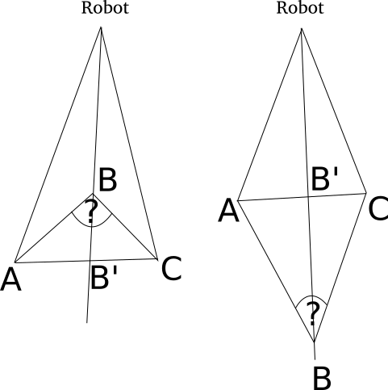

[back to index](index.md)

# Peak Filter
Peak filter is a very simplified noise blanker. It looks for sharp peaks, both convex and concave, and flatterns them. It can't harm the real data, because real peaks are never so sharp and even if they were, it would flattern only one point, while the rest would stay. When the sharp peak is detected, it puts an average value of the neighbour points instead. The *Peak Filter* filters only when there are three neighbour points, all with a valid value.

This filter is not used by default.

## Parameters
* `max_filter_angle` (in radians) - The maximum angle of the peak.
* `passes` - The count of total passes. Usually it's not neccessary to put a higher value than one.

## Input and Output.
The input can be any data set from laser scanner in any phase of filtration.

The output is a laser data set with flattered peaks.

## Example Configuration
```yaml
    -   name: PeakFilter
        type: nifti_laser_filtering/PeakFilter
        params:
            max_filter_angle: 0.524  # radians
            passes: 3 
```

## Geometry
*A*, *B* and *C* are three neighbour measured points. When the angle marked as question mark is too sharp, it changes the point *B* to *B'*. The peak might be convex or concave, as shown bellow.


